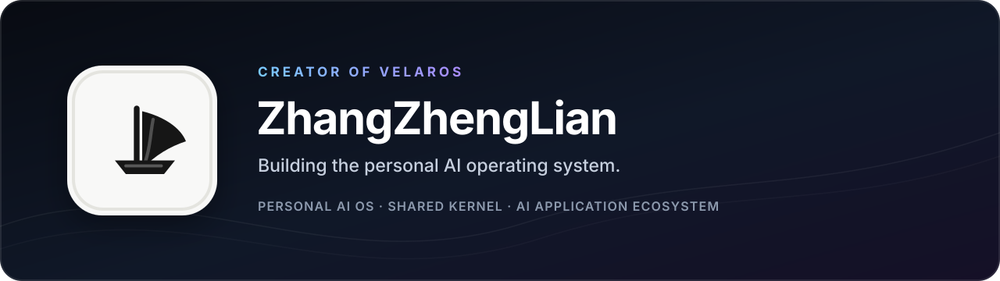

  

<h1 align="center">Hi, I'm ZhangZhengLian 👋</h1>

  <strong>Creator of VelarOS</strong> 
  Building a personal AI operating system and the shared kernel behind an ecosystem of AI applications.

  <a href="https://velaros.cn">VelarOS</a>
  ·
  <a href="https://github.com/Error-Zhang/VelarOS-HTML-Artifacts">Open-source work</a>
  ·
  <a href="mailto:zhenglian0906@gmail.com">Email</a>

## What I'm building

I want AI to become a durable personal system: one that can carry context forward, act on real work, and remain under the user's control—not just another disposable chat window.

**VelarOS** is a personal AI operating system and the application ecosystem growing around **VelarOS Kernel**.

- **VelarOS Kernel** is the shared foundation for execution, capabilities, memory, permissions, context, state, and APIs across different AI applications.
- **VelarOS Desktop** is the first real product built on that foundation: a desktop shell, a proving ground for the Kernel, and its reference product.
- **The VelarOS ecosystem** is the longer-term direction: AI applications, skills, plugins, and capability providers that share one trusted system foundation without losing their own product identity.

> 让 AI 不只回答一次，而是在用户掌控下，持续理解、执行并延续同一个人和同一件事。

## Current focus

- Durable agent execution, long-running tasks, recovery, and observability
- User-owned memory, knowledge, and context continuity
- Permission boundaries, human checkpoints, and auditable actions
- Desktop experiences that connect projects, the browser, and local system capabilities
- Stable Kernel APIs that future AI applications can reuse

## Technology

  
  
  
  
  
  
  

Most of my work sits where product design, desktop systems, agent runtimes, and AI infrastructure meet. I care less about adding another model wrapper and more about building the system around the model: execution, memory, permissions, context, state, and recovery.

## Public work

### [VelarOS HTML Artifacts](https://github.com/Error-Zhang/VelarOS-HTML-Artifacts)

A streaming HTML artifact protocol and sandboxed iframe runtime extracted from VelarOS. It lets AI-generated interfaces arrive incrementally while keeping rendering isolated and controlled.

VelarOS is under active development. I publish reusable components when they are mature enough to stand on their own.

## What I believe

- AI should do real work, not only produce plausible text.
- Memory and long-term state should serve the user, with clear provenance and the ability to correct or forget.
- Powerful automation needs visible state, explicit boundaries, and reliable recovery.
- AI applications should reuse a trusted kernel instead of rebuilding execution, memory, and permissions from scratch.

  <strong>Building VelarOS from the Kernel outward.</strong> 
  <a href="https://velaros.cn">velaros.cn</a>

